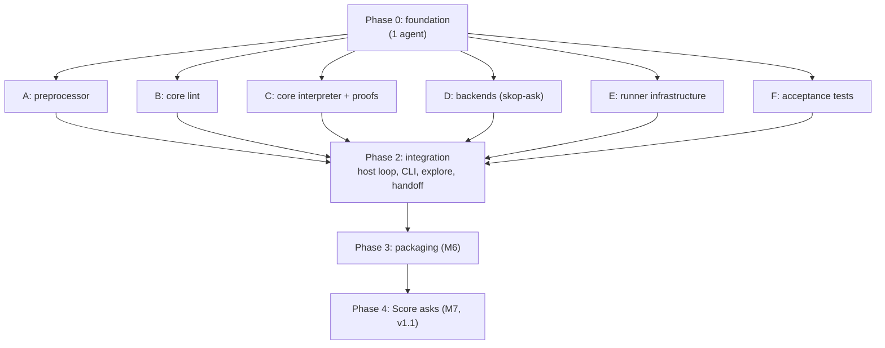

# skop build plan

How to build skop from `SPEC.md` with several agents working in parallel,
test-first, with every stage verified by CI. Milestones M1–M7 are defined in
SPEC §12.3; this plan says who builds what, in what order, and how each
piece is proven done.

---

## 1. Principles

- **Contracts first.** One agent writes the shared contracts before anyone
  else starts. After that, parallel agents only meet at those contracts, so
  they never wait on each other's code.
- **One owner per directory.** An agent edits only the directories it owns.
  A change anywhere else, contracts included, goes through a PR that the
  owner reviews.
- **Tests before code, every stage.** Each stream starts by turning its
  part of the spec into failing tests. Code is written to make them pass.
  In Dafny, the "test" for a proof is the lemma: state it first, then make
  `dafny verify` accept it.
- **Acceptance tests are written by someone else.** A dedicated test agent
  writes the milestone tests straight from the spec, independently of the
  agents writing the code. That catches misreadings of the spec on both
  sides.
- **Red tests are allowed, but only as expected failures.** A test written
  before its feature is marked expected-to-fail (`test.fails` in Vitest).
  CI checks that it still fails. When the feature lands, the owner flips it
  to a normal test in the same PR. Nothing is ever skipped silently.
- **Main is always green.** Every PR runs the full CI gate (§5). Streams
  merge small PRs often rather than one big one at the end.

---

## 2. Phases at a glance

| Phase | Agents | Milestones closed |
|---|---|---|
| 0. Foundation | 1 | none; unblocks everyone |
| 1. Parallel streams A–F | 6 | M1 (A); most of M2 (B, C); backend half of M4 (D); runner half of M4 (E) |
| 2. Integration | 1–2 | rest of M2, M3, M4, M5 |
| 3. Packaging | 1 | M6 |
| 4. Score asks | up to 4 (stream owners) | M7 |

The critical path is **C** (the Dafny interpreter and its proofs). Phase 2
starts wiring against a stand-in interpreter, so it isn't blocked by C
(§4, stream G).

---

## 3. Phase 0: foundation (one agent, serial)

Everything the parallel agents share. Nothing here implements features.

**Already in the repo** (so Phase 0 builds on them rather than from
scratch):
- `.github/workflows/ci.yml`: the test workflow (§5). Its build, test and
  Dafny jobs switch on by themselves once `package.json` and
  `.dafny-version` exist.
- `.github/workflows/release.yml`: the release workflow (§10).
- `scripts/check_spec.py`: spec and plan checks, and the error-code
  coverage check.
- `scripts/build-id.mjs`: the build identity (SPEC §7.2).
- `LICENSE-MIT` and `LICENSE-APACHE`: skop is dual-licensed, like ply.

**Repository and toolchain**
- Node 20+, TypeScript, Vitest, a formatter and linter.
- A pinned Dafny version, with `dafny verify` and translation to JavaScript
  running in CI (SPEC §5.5).
- `package.json` with `"version": "0.1.0"` and
  `"license": "MIT OR Apache-2.0"`, and scripts named `typecheck`, `lint`,
  `build` and `test`, which is what the CI workflow calls.
- `npm run build` runs `node scripts/build-id.mjs --write
  dist/build-identity.json` first, and the CLI reads the identity from
  that one file. There's no other copy of the version anywhere.
- `.dafny-version` holding the pinned Dafny version. The CI workflow reads
  it.

**Spike: Dafny to JavaScript.** This is the riskiest integration, so prove it
works on day one. Write a tiny Dafny module, verify it, translate it to JS,
and call it from TypeScript through a first version of the adapter
`core.ts`. If this is painful, raise it now (SPEC §13), before six agents
depend on it.

**Contracts** (in `contracts/`, owned by the Phase 0 agent, later by the
integration agent):

| Contract | Between | Source in the spec |
|---|---|---|
| Core program JSON schema, with 3 hand-written examples | preprocessor (A) and core (B, C) | §5.1 |
| Dafny AST types, `Syntax.dfy` | lint (B) and interpreter (C) | §5.1, §5.2 |
| `Step` interface: requests, responses, events | core (C) and host (G) | §5.2 |
| Ask request and answer schema, including `unassigned` | host (G) and backends (D) | §6.1 |
| Fake file formats: answers and commands | fakes (D, E) and tests (F) | §5.4, §6.2 |
| Log event schema | everyone who emits events | §10 |
| Error code table, generated from SPEC §7.1 | everyone who reports errors | §7.1 |

Each schema gets a TypeScript type generated from it, so a contract change
breaks the build everywhere it matters.

**Test harness**
- A golden-file helper that ignores `ts`, `ms`, `run_id`, `host`,
  `skill_hash` and file paths (SPEC §12.3).
- The three example skills copied out of the spec into `fixtures/`:
  disk-full, cert-expiry and error-triage.
- **Spec coverage check.** A script that reads the code table in SPEC §7.1
  and fails CI if any code except `E-INTERNAL` and `E-IO` has no test
  (SPEC §12.2).
- **No-cheating check.** CI fails if Dafny code contains `assume`,
  `{:axiom}` or `{:verify false}` (SPEC §5.3).

**Done when:** CI is green on all three platforms, the Dafny spike runs from
TypeScript, every contract has a schema, a generated type and at least one
example that validates against it, and `skop --version` prints the release
version and build identity.

---

## 4. Phase 1: parallel streams

Each stream below is a self-contained brief for one agent. Every stream
follows the same loop:

1. **Red.** Turn the listed spec sections into failing tests.
2. **Green.** Write the least code that passes them.
3. **Refactor**, with the tests still green.
4. **Merge** a small PR. CI runs the full gate.

### A. Preprocessor (TypeScript)
- **Owns:** `src/preprocess/`, `tests/preprocess/`.
- **Input:** a Markdown skill. **Output:** core program JSON and a source
  map (contract).
- **Tests first:**
  - every parse-level code in SPEC §7.1, each with its case from §12.2 and
    the right line number;
  - the positive cases: `**Note:**` and a mid-paragraph `**run**` are
    prose, prose-only sections are fine, lists under `###` headings run in
    order;
  - golden core JSON for disk-full and cert-expiry;
  - **property test for the core safety rule:** for any generated Markdown,
    a list item that starts with a bold keyword either parses as an
    instruction or produces an error. It never comes out as prose.
  - fuzzing: the preprocessor never crashes, whatever the input.
- **Done when:** M1 passes.

### B. Core lint (Dafny)
- **Owns:** `core/Lint.dfy`, `tests/lint/`.
- **Input:** core program JSON, written by hand, so B doesn't wait for A.
- **Tests first:** every lint code and warning in SPEC §7.1, from
  hand-written core JSON examples. Run them through the compiled core from
  TypeScript, plus Dafny `{:test}` methods for small units.
- **Proof work:** the lint half of P6 (lint soundness), stated as lemmas
  before the lint code is written.
- **Done when:** every semantic negative test fails with the right code and
  line, and the lint lemmas verify.

### C. Core interpreter and proofs (Dafny)
- **Owns:** `core/Interp.dfy`, `core/Proofs.dfy`, `tests/core/`.
- **Input:** hand-written core JSON and scripted responses.
- **Tests first:**
  - step-by-step traces for small programs: each instruction, each kind of
    failure, `for each`, transfers, dry run;
  - answer validation and the gate (SPEC §6.1, §4.2): every invalid
    response in §12.2, ties, and the `unassigned` case (A = 0.5, B = 0.2,
    unassigned = 0.3 at 40% must fail);
  - question text: trusted values pasted in, `run` outputs named in
    backticks and sent as context, decided by each value's origin.
- **Proofs first:** state P1 to P6 (SPEC §5.3) as lemmas at the start. They
  are the stream's main red tests.
- **Timebox.** Agree a proof budget up front. If P1–P6 aren't verifying by
  then, stop and raise it. The fallback in SPEC §13 is the same design in
  plain TypeScript with property tests, and that's a human decision.
- **Done when:** `dafny verify` passes with P1–P6 and no `assume`, and the
  trace tests pass.

### D. Backends: `skop-ask` (TypeScript)
- **Owns:** `src/ask/`, `tests/ask/`, `tests/recordings/`.
- **Input:** the ask request schema. **Output:** the ask answer schema.
  Doesn't need the core at all.
- **Tests first,** against recorded HTTP responses with no network:
  - `jev`: the full request shape with the `questions` map, labels as keys
    mapped back to ids, `answers.q`, context holding only named outputs,
    retries (0 and 3), 429 with `retry-after` inside and beyond the
    timeout, `W-MODEL-ALIAS`, and a too-large request with no retry;
  - `openrouter`: letters to options, the 97.1% example failing a 99%
    gate, low letter mass, missing logprobs, a reasoning-only reply,
    `E-BACKEND-MODEL`, `E-BACKEND-LIMIT`, and service labels in the prompt;
  - `fake`: answers keyed by question text or source id.
- **Recordings:** one opt-in live test per backend and question kind
  records real responses, so fixtures come from the real APIs. It needs API
  keys and never runs in normal CI.
- **Done when:** the backend half of M4 passes.

### E. Runner infrastructure (TypeScript)
- **Owns:** `src/runner/`, `tests/runner/`.
- **Scope:** everything that touches the machine, behind plain interfaces:
  running commands (SPEC §4.4), the fake command handler, the lock (§7),
  redaction (§9), config loading, the pager, and error and event output
  (§7.1, §10).
- **Tests first:**
  - process rules with real child processes: `/dev/null` stdin,
    `LC_ALL=C`, process-group kill after the grace period, output capped at
    capture time;
  - the lock with two real processes racing: held, stale, owner-only
    delete;
  - each built-in redaction pattern, and `W-REDACT-OFF`;
  - config errors (`E-CONFIG`), the pager getting its message as input, and
    a pager failure not changing the outcome.
- **Done when:** the runner half of M4 passes on Linux and macOS.

### F. Acceptance tests (TypeScript)
- **Owns:** `tests/acceptance/`, `fixtures/*/fakes/`.
- **Job:** write the milestone tests from the spec before the features
  exist, as expected failures. Other streams flip them to passing.
- **Writes:**
  - the fake answer and command files for every scenario in SPEC §12.1, for
    each example skill;
  - the expected event stream (golden JSONL) for each scenario, written by
    hand from the spec and reviewed by a human, since these are the ground
    truth for M3;
  - end-to-end CLI tests for exit codes, `E-MODE`, param errors, handoff
    paging (M5) and dry run;
  - the differential check (SPEC §12.4), ready to run once integration
    lands.
- **Done when:** every M3 and M5 scenario has a test, all marked as
  expected failures, and a human has reviewed the goldens.

---

## 5. CI gate (every PR, every stream)

The CI workflow is `.github/workflows/ci.yml`. It runs on every push and
pull request, on linux-x64, linux-arm64 and macOS-arm64.

| Check | Fails when |
|---|---|
| Spec and plan checks | an error code is used but not defined, a JSON example doesn't parse, or a diagram doesn't render |
| Type check and lint | any error |
| Unit and property tests | any failure, or an expected failure that starts passing without being flipped |
| `dafny verify` | any unproven obligation |
| No-cheating check | `assume`, `{:axiom}` or `{:verify false}` in Dafny code |
| Contract check | a contract example doesn't validate, or generated types are stale |
| Spec coverage check | an error code has no test |
| Golden files | any mismatch, ignoring the fields in SPEC §12.3 |
| Differential check (from Phase 2) | a fake run's trace isn't among the explored paths |
| Platforms | any of the above fails on linux-x64, linux-arm64 or macOS-arm64 |

---

## 6. Phase 2: integration (stream G)

One agent, joined by a second once the pieces arrive.

- **Owns:** `src/host/`, `src/cli/`, and the contracts from here on.
- **Starts early,** against a stand-in interpreter that returns scripted
  requests through the real `Step` interface. That lets the host loop, CLI
  flags and logging be built and tested before C finishes. The stand-in is
  deleted once the real core arrives.
- **Builds:**
  - the host loop: calls `Step`, emits events, answers requests through the
    real, fake or explore handler;
  - the explore handler and the `--verify` and `--explain` reports (SPEC
    §5.4, §5.6);
  - the CLI: mode flags, params, deadline, run directory, exit codes;
  - handoff: the record, the preamble, and the paging rules (SPEC §8).
- **Verified by:** flipping F's expected failures to passing. That closes
  M2 (the verify report), M3, M4 and M5, and turns on the differential
  check.

---

## 7. Phase 3: packaging (M6)

- Build the npm package and container image.
- Install the package on a clean machine with only Node and run the fake
  test suite on all three platforms.
- Smoke-test the container image with each example skill in dry run.

---

## 8. Phase 4: Score asks (M7, v1.1)

After v1 ships. The same stream owners pick up their part in parallel:

| Stream | Work |
|---|---|
| A | Score grammar and rubric parsing |
| B | Score lint codes and warnings |
| C | the Score gate, binding integers, and P4–P6 still verifying |
| D | Jev Score mapping (level `i` is `LOW + i`) and OpenRouter letters |
| F | error-triage scenarios and goldens, written first as expected failures |

**Done when:** M7 passes.

---

## 9. Running the agents

- **One agent per stream**, each in its own git worktree and branch, named
  after the stream (for example `stream/a-preprocessor`).
- **Each agent gets its stream brief from §4 as its task**, plus the spec
  and the contracts. The brief lists what it owns, what it may read, and
  when it's done.
- **Small PRs to main,** each passing the CI gate. A PR that touches another
  stream's directory needs that owner's review.
- **Contract changes are rare and deliberate.** The contract owner makes
  the change and updates the examples. Every affected stream fixes its side
  in the same PR or the next one.
- **Questions about the spec go to a human,** not into code. If an agent
  finds the spec ambiguous or wrong, it opens an issue quoting the section,
  marks the affected test as an expected failure, and moves on.
- **Checkpoints:** end of Phase 0, the proof timebox in stream C, end of
  Phase 1, and each milestone. At each one a human reviews what's merged.

---

## 10. Releasing

Versioning follows ply (SPEC §7.2): a hand-edited release version in
`package.json`, and a build identity hashed from the source.

1. Bump `version` in `package.json` in a normal PR, and merge it once CI is
   green.
2. Tag that commit `v` plus the version, for example `v0.1.0`, and push the
   tag.
3. `.github/workflows/release.yml` then:
   - reruns the full test workflow;
   - refuses to go on if the tag doesn't match `package.json`;
   - builds the npm package once;
   - installs it on a clean machine on each platform, checks
     `skop --version`, and lints and dry-runs each example skill with fakes;
   - creates the GitHub release with the package attached;
   - builds and pushes the container image to
     `ghcr.io/mattyv/skop` for linux/amd64 and linux/arm64;
   - publishes to npm, only if an `NPM_TOKEN` secret is set.

The release workflow fails on purpose until there's code to release: it
needs `package.json` for the package and a `Dockerfile` for the image.
