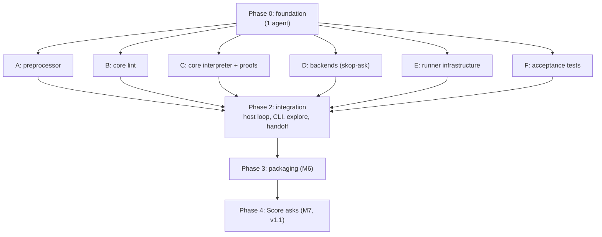
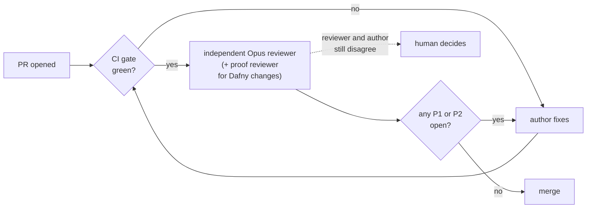

# skop build plan

How to build skop from `SPEC.md` with several agents working in parallel,
test-first, with every stage verified by CI. Milestones M1–M7 are defined in
SPEC §12.3; this plan says who builds what, in what order, and how each
piece is proven done.

---

## 1. Principles

- **Contracts first.** One agent writes the shared contracts before anyone
  else starts. After that, parallel agents only meet at those contracts, so
  they never wait on each other's code.
- **One owner per directory.** An agent edits only the directories it owns.
  A change anywhere else, contracts included, goes through a PR that the
  owner reviews.
- **Tests before code, every stage.** Each stream starts by turning its
  part of the spec into failing tests. Code is written to make them pass.
  In Dafny, the "test" for a proof is the lemma: state it first, then make
  `dafny verify` accept it.
- **Acceptance tests are written by someone else.** A dedicated test agent
  writes the milestone tests straight from the spec, independently of the
  agents writing the code. That catches misreadings of the spec on both
  sides.
- **Red tests are allowed, but only as expected failures, and only until
  their milestone closes.** A test written before its feature is marked
  expected-to-fail (`test.fails` in Vitest). CI checks that it still fails.
  When the feature lands, the owner flips it to a normal test in the same
  PR. Nothing is ever skipped silently.
- **Green CI isn't the same as a finished milestone.** An expected failure
  passes CI. So a milestone is done only when all its acceptance tests, in
  `tests/acceptance/<milestone>/`, pass as normal tests. Closing it means
  adding its name to `tests/acceptance/CLOSED`. From then on CI fails if any
  of its tests is an expected failure, skip or todo.
- **Build the smallest thing that works.** Every agent writes code with the
  [ponytail](https://github.com/DietrichGebert/ponytail) skill active
  (v4.10.0, MIT, in `.claude/skills/`), and every change is checked by
  `ponytail-review` before it merges. §6.4 says where ponytail doesn't apply.
- **Nobody reviews their own work.** Every PR gets one independent Opus
  reviewer, plus a proof reviewer for Dafny changes. Every milestone gets
  the full panel (§6).
- **Main is always green.** A PR merges only when the CI gate (§5) passes
  and its review has no open blocking findings (§6). Streams merge
  small PRs often rather than one big one at the end.

---

## 2. Phases at a glance

| Phase | Agents | Milestones closed |
|---|---|---|
| 0. Foundation | 1 | none; unblocks everyone |
| 1. Parallel streams A–F | 6 | M1 (A); most of M2 (B, C); backend half of M4 (D); runner half of M4 (E) |
| 2. Integration | 1–2 | rest of M2, M3, M4, M5 |
| 3. Packaging | 1 | M6 |
| 4. Score asks | up to 4 (stream owners) | M7 |

The critical path is **C** (the Dafny interpreter and its proofs). Phase 2
starts wiring against a stand-in interpreter, so it isn't blocked by C
(§7, stream G).

---

## 3. Phase 0: foundation (one agent, serial)

Everything the parallel agents share. Nothing here implements features.

**Already in the repo** (so Phase 0 builds on them rather than from
scratch):
- `.github/workflows/ci.yml`: the test workflow (§5). Its build, test and
  Dafny jobs switch on by themselves once `package.json` and
  `.dafny-version` exist.
- `.github/workflows/release.yml`: the release workflow (§11).
- `scripts/check_spec.py`: spec and plan checks, and the error-code
  coverage check.
- `scripts/build-id.mjs`: the build identity (SPEC §7.2).
- `LICENSE-MIT` and `LICENSE-APACHE`: skop is dual-licensed, like ply.

**Repository and toolchain**
- Node 20+, TypeScript, Vitest, and Biome as the formatter and linter
  (`npm run lint`, `npm run format`), so parallel agents don't produce
  formatting noise in each other's diffs.
- A pinned Dafny version, with `dafny verify` and translation to JavaScript
  running in CI (SPEC §5.5).
- `package.json` with `"version": "0.1.0"` and
  `"license": "MIT OR Apache-2.0"`, and scripts named `typecheck`, `lint`,
  `build` and `test`, which is what the CI workflow calls.
- `npm run build` runs `node scripts/build-id.mjs --write
  dist/build-identity.json` first, and the CLI reads the identity from
  that one file. There's no other copy of the version anywhere.
- `.dafny-version` holding the pinned Dafny version. The CI workflow reads
  it.

**Spike: Dafny to JavaScript, end to end.** This is the riskiest
integration, so prove it works before anything else, and before the
contracts are frozen or the six parallel streams start:
1. A tiny Dafny module, verified, translated to JavaScript and called from
   TypeScript through a first version of the adapter `core.ts`.
2. One tiny program taken through lint, execution and a fake handler.
3. A test showing dry run suppresses its effect: the `do` never reaches
   the handler, and a `would_do` event is emitted instead.

If any step is painful, raise it now (SPEC §13), before six agents depend on
it. The contracts are frozen, and Phase 1 starts, only after all three work.

**Spike result: all three work** (`core/`, `src/`, `tests/spike/`), after
an independent review and a proof review. What the next agents need to know:
- **Dafny 4.11.0**, pinned in `.dafny-version`. `npm run core` verifies the
  core and writes `core/generated/core.cjs`, which is committed, so tests
  and releases never need Dafny. CI verifies every tracked `.dfy` file,
  rebuilds the JavaScript, and fails if the committed file is stale.
- Dafny's JavaScript bundles its runtime with `--include-runtime`, needs
  the `bignumber.js` package, and exports nothing, so the build appends an
  export line.
- The build turns off `--optimize-erasable-datatype-wrapper`. With it on,
  a one-field datatype is erased to its field inside functions but not in
  its constructor, so values built by the adapter don't match what the
  compiled functions expect.
- **Compiled Dafny checks nothing at run time**: not preconditions, not
  `nat` or `int`. `src/core.ts` is the only file that touches it, and it
  refuses anything it can't represent exactly, rather than rewriting it.
  It also enforces `Step`'s rules: a command's result must come back after
  an exec, and there's no step after the run is done.
- **Proofs must carry state, not just constrain one step.** The first
  version proved "this step never returns a `do` in dry run" but not that
  the dry-run flag survives the step, so two broken versions still
  verified. Now `Start`, `Advance` and `Step` preserve `dry` and `prog`, a
  `done` flag enforces P2, a measure gives P1, and `DryRunNeverDoes`
  proves P3 over a whole run. Four deliberately broken versions each fail
  verification.
- **Randomised tests must show they generate the interesting case.** The
  first dry-run test never generated a `do`. It's now exhaustive (every
  run/do sequence up to six long) and asserts how many contain a `do`.
- Event names follow SPEC §10: `run`, `effect_start`, `effect_end`,
  `would_do`, `outcome`, with `after_would_do` on reads after a `would_do`.

**Contracts** (in `contracts/`, owned by the Phase 0 agent, later by the
integration agent; `contracts/README.md` lists the files and the decisions
the spec left open):

| Contract | Between | Source in the spec |
|---|---|---|
| Core program JSON schema, with 3 hand-written examples | preprocessor (A) and core (B, C) | §5.1 |
| Dafny AST types, `Syntax.dfy` | lint (B) and interpreter (C) | §5.1, §5.2 |
| `Step` interface: requests, responses, events | core (C) and host (G) | §5.2 |
| Ask request and answer schema, including `unassigned` | host (G) and backends (D) | §6.1 |
| Fake file formats: answers and commands | fakes (D, E) and tests (F) | §5.4, §6.2 |
| Log event schema | everyone who emits events | §10 |
| Error code table, generated from SPEC §7.1 | everyone who reports errors | §7.1 |

Each schema gets a TypeScript type generated from it, so a contract change
breaks the build everywhere it matters.

Contracts are the hardest thing to change later, so they get the strictest
review before Phase 1 starts. An Opus spec-conformance reviewer checks each
one against the spec, and `ponytail-review` at **ultra** hunts for fields
and options nothing in the spec needs (§6).

**Test harness**
- A golden-file helper that ignores `ts`, `ms`, `run_id`, `host`,
  `skill_hash` and file paths (SPEC §12.3).
- The example skills copied out of the spec: disk-full and cert-expiry into
  `fixtures/`, and error-triage into `fixtures-next/`. Only `fixtures/`
  ships with a release, so the Score example (v1.1) moves across as part of
  M7. Each fake scenario directory holds `answers.yaml`, `commands.yaml` and
  `expected-exit`, since paged (10) and handoff (20) are correct results
  that the release smoke test must not treat as failures.
- **Spec coverage check.** `scripts/check_spec.py coverage` fails CI if a
  code in SPEC §7.1, except `E-INTERNAL` and `E-IO`, isn't named in any
  test file once the code's milestone has closed: parse and lint codes at
  M2, argument, runtime and backend codes at M4, Score codes at M7. Before
  that it lists what's missing. It's a **reference check** only: it shows a
  code is mentioned, not that a test exercises it. Reviewers and the
  milestone check cover the rest.
- **Milestone check.** `scripts/check_spec.py milestones` enforces the
  closed-milestone rule in §1.
- **No-cheating check.** CI fails if Dafny code contains `assume`,
  `{:axiom}` or `{:verify false}` (SPEC §5.3).

**Done when:** CI is green on all three platforms, the Dafny spike runs from
TypeScript, every contract has a schema, a generated type and at least one
example that validates against it, `skop --version` prints the release
version and build identity, and the Phase 0 milestone review (§6.3) has no
open blocking findings.

---

## 4. Phase 1: parallel streams

Each stream below is a self-contained brief for one agent. Every stream
follows the same loop:

1. **Red.** Turn the listed spec sections into failing tests.
2. **Green.** Write the least code that passes them, with `ponytail` active
   at **full**. Climb its ladder before writing anything new: reuse what's
   in the repo, then the standard library, then an installed dependency.
   Mark any deliberate shortcut with a `ponytail:` comment naming its limit
   and when to revisit it.
3. **Refactor.** Run `ponytail-review` on your own diff and apply the cuts
   that keep the tests green.
4. **Open a small PR.** CI runs the full gate (§5), then the review
   runs (§6).
5. **Merge** when CI is green and no blocking finding is open.

### A. Preprocessor (TypeScript)
- **Owns:** `src/preprocess/`, `tests/preprocess/`.
- **Input:** a Markdown skill. **Output:** core program JSON and a source
  map (contract).
- **Tests first:**
  - every parse-level code in SPEC §7.1, each with its case from §12.2 and
    the right line number;
  - the positive cases: `**Note:**` and a mid-paragraph `**run**` are
    prose, prose-only sections are fine, lists under `###` headings run in
    order;
  - golden core JSON for disk-full and cert-expiry;
  - **property test for the core safety rule:** for any generated Markdown,
    a list item that starts with a bold keyword either parses as an
    instruction or produces an error. It never comes out as prose.
  - fuzzing: the preprocessor never crashes, whatever the input.
- **Done when:** M1 passes.

### B. Core lint (Dafny)
- **Owns:** `core/Lint.dfy`, `tests/lint/`.
- **Input:** core program JSON, written by hand, so B doesn't wait for A.
- **Tests first:** every lint code and warning in SPEC §7.1, from
  hand-written core JSON examples. Run them through the compiled core from
  TypeScript, plus Dafny `{:test}` methods for small units.
- **Proof work:** the lint half of P6 (lint soundness), stated as lemmas
  before the lint code is written.
- **Done when:** every semantic negative test fails with the right code and
  line, and the lint lemmas verify.

### C. Core interpreter and proofs (Dafny)
- **Owns:** `core/Interp.dfy`, `core/Proofs.dfy`, `tests/core/`.
- **Input:** hand-written core JSON and scripted responses.
- **Tests first:**
  - step-by-step traces for small programs: each instruction, each kind of
    failure, `for each`, transfers, dry run;
  - answer validation and the gate (SPEC §6.1, §4.2): every invalid
    response in §12.2, ties, and the `unassigned` case (A = 0.5, B = 0.2,
    unassigned = 0.3 at 40% must fail);
  - question text: trusted values pasted in, `run` outputs named in
    backticks and sent as context, decided by each value's origin.
- **Proofs first:** state P1 to P6 (SPEC §5.3) as lemmas at the start. They
  are the stream's main red tests.
- **Timebox.** Agree a proof budget up front. If P1–P6 aren't verifying by
  then, stop and raise it. The fallback in SPEC §13 is the same design in
  plain TypeScript with property tests, and that's a human decision.
- **Done when:** `dafny verify` passes with P1–P6 and no `assume`, and the
  trace tests pass.

### D. Backends: `skop-ask` (TypeScript)
- **Owns:** `src/ask/`, `tests/ask/`, `tests/recordings/`.
- **Input:** the ask request schema. **Output:** the ask answer schema.
  Doesn't need the core at all.
- **Tests first,** against recorded HTTP responses with no network:
  - `jev`: the full request shape with the `questions` map, labels as keys
    mapped back to ids, `answers.q`, context holding only named outputs,
    retries (0 and 3), 429 with `retry-after` inside and beyond the
    timeout, `W-MODEL-ALIAS`, and a too-large request with no retry;
  - `openrouter`: letters to options, the 97.1% example failing a 99%
    gate, low letter mass, missing logprobs, a reasoning-only reply,
    `E-BACKEND-MODEL`, `E-BACKEND-LIMIT`, and service labels in the prompt;
  - `fake`: answers keyed by question text or source id.
- **Recordings:** one opt-in live test per backend and question kind
  records real responses, so fixtures come from the real APIs. It needs API
  keys and never runs in normal CI.
- **Done when:** the backend half of M4 passes.

### E. Runner infrastructure (TypeScript)
- **Owns:** `src/runner/`, `tests/runner/`.
- **Scope:** everything that touches the machine, behind plain interfaces:
  running commands (SPEC §4.4), the fake command handler, the lock (SPEC §7),
  redaction (SPEC §9), config loading, the pager, and error and event output
  (SPEC §7.1, §10).
- **Tests first:**
  - process rules with real child processes: `/dev/null` stdin,
    `LC_ALL=C`, process-group kill after the grace period, output capped at
    capture time;
  - the lock with two real processes racing: held, stale, owner-only
    delete;
  - each built-in redaction pattern, and `W-REDACT-OFF`;
  - config errors (`E-CONFIG`), the pager getting its message as input, and
    a pager failure not changing the outcome.
- **Done when:** the runner half of M4 passes on Linux and macOS.

### F. Acceptance tests (TypeScript)
- **Owns:** `tests/acceptance/`, `fixtures/*/fakes/`.
- **Job:** write the milestone tests from the spec before the features
  exist, as expected failures. Other streams flip them to passing.
- **Writes:**
  - the fake answer and command files for every scenario in SPEC §12.1, for
    each example skill;
  - the expected event stream (golden JSONL) for each scenario, written by
    hand from the spec and reviewed by a human, since these are the ground
    truth for M3;
  - end-to-end CLI tests for exit codes, `E-MODE`, param errors, handoff
    paging (M5) and dry run;
  - the differential check (SPEC §12.4), ready to run once integration
    lands.
- **Done when:** every M3 and M5 scenario has a test, all marked as
  expected failures, and a human has reviewed the goldens.

---

## 5. CI gate (every PR, every stream)

The CI workflow is `.github/workflows/ci.yml`. It runs on every push and
pull request, on linux-x64, linux-arm64 and macOS-arm64. Passing CI is
necessary but not enough to merge: the review (§6) runs after it.

| Check | Fails when |
|---|---|
| Spec and plan checks | an error code is used but not defined, a JSON example doesn't parse, or a diagram doesn't render |
| Type check and lint | any error |
| Unit and property tests | any failure, or an expected failure that starts passing without being flipped |
| `dafny verify` | any unproven obligation |
| No-cheating check | `assume`, `{:axiom}` or `{:verify false}` in Dafny code |
| Contract check | a contract example doesn't validate, or generated types are stale |
| Spec coverage check (reference only) | an error code whose milestone has closed isn't named in any test file |
| Milestone check | a closed milestone has an expected failure, skip or todo, or no tests |
| Golden files | any mismatch, ignoring the fields in SPEC §12.3 |
| Differential check (from Phase 2) | a fake run's trace isn't among the explored paths |
| Platforms | any of the above fails on linux-x64, linux-arm64 or macOS-arm64 |

---

## 6. Reviews: Opus agents and ponytail

### 6.1 Review on every PR

Once CI passes, **one independent reviewer** checks the PR. It's an
**Opus** agent in a fresh session that **didn't write the code**. It gets
the diff, `SPEC.md`, `PLAN.md` and the stream's brief, and nothing from the
author's session, so it judges the code rather than the reasoning behind
it. Reviewers are read-only: they comment, and never push.

The one reviewer covers three things, in this order:
1. **Correctness and security:** bugs, unsafe input handling, taint leaks
   into commands, shell and process mistakes, races. It uses the
   `code-review` skill.
2. **Spec conformance:** the change does what the cited spec sections say,
   no more and no less, and each test checks the clause it claims to.
3. **Simplification:** `ponytail-review`, ending with `net: -N lines
   possible`.

A PR that touches `core/*.dfy` also gets a **proof reviewer**, a second
Opus agent. It checks that the lemmas say what SPEC P1–P6 mean and not
something weaker, and looks for vacuous preconditions, assumptions that can
never hold, and missing cases.

The fuller panel, with a separate test reviewer that breaks the code on
purpose to see whether tests catch it, runs at milestones (§6.3), where its
cost is paid once rather than on every small PR.

### 6.2 Findings and how they're resolved

Findings use the same shape as the outside reviews the spec went through:

| Severity | Meaning | Before merge |
|---|---|---|
| **P1** | Wrong behaviour, a spec violation, an unsound or vacuous proof, a security hole | must be fixed |
| **P2** | A real problem that isn't blocking on its own. Ponytail `delete` and `yagni` findings on production code count as P2. | fix, or reply with a reason the reviewer accepts |
| **nit** | Optional. Ponytail `shrink` findings count as nits. | one-line reply; fix if it's cheap |

- The author fixes or replies on each finding. The **same reviewer**
  re-checks the new head, since a fresh reviewer would re-litigate.
- A disagreement the reviewer won't drop goes to a human, never to a
  vote between agents.
- A reviewer's finding is a claim to check, not an order. The author
  verifies it against the spec before acting on it.

### 6.3 Milestone reviews

At each checkpoint (end of Phase 0, the stream C proof timebox, end of
Phase 1, and each milestone):

1. **Whole-milestone review panel.** Separate Opus agents each read the
   merged code against the whole spec, the way the spec itself was
   reviewed, with P1 and P2 findings and spec section references:
   - spec conformance;
   - correctness and security;
   - proofs, when the milestone includes Dafny;
   - tests: each one is checked by breaking the code on purpose and
     confirming a test fails.
2. **`ponytail-audit` at ultra** over the whole repo, ranked biggest cut
   first.
3. **`ponytail-debt`** lists every `ponytail:` shortcut. Any shortcut with
   no revisit trigger gets one, or gets fixed.
4. **The milestone check** passes: every acceptance test for the
   milestone runs as a normal test, with none expected to fail (§1).
5. **A human** reads the reports and decides whether the next phase starts.

### 6.4 Where ponytail doesn't apply

Ponytail's own rules already exempt some of these; they're listed here so
no agent has to guess:
- **Tests this plan asks for.** Ponytail's "one self-check, no test suites
  unless asked" rule doesn't apply: this plan asks for the full suites.
- **Anything the spec marks MUST.** Validation, redaction, the taint rule,
  the safe-value check and error handling are never simplified away.
- **Proofs.** A proof isn't shortened by proving less. The proof reviewer
  treats a dropped obligation as a P1.
- **Contracts,** once frozen. Cutting a field is a contract change (§10),
  not a refactor.

---

## 7. Phase 2: integration (stream G)

One agent, joined by a second once the pieces arrive.

- **Owns:** `src/host/`, `src/cli/`, and the contracts from here on.
- **Starts early,** against a stand-in interpreter that returns scripted
  requests through the real `Step` interface. That lets the host loop, CLI
  flags and logging be built and tested before C finishes. The stand-in is
  deleted once the real core arrives.
- **Builds:**
  - the host loop: calls `Step`, emits events, answers requests through the
    real, fake or explore handler;
  - the explore handler and the `--verify` and `--explain` reports (SPEC
    §5.4, §5.6);
  - the CLI: mode flags, params, deadline, run directory, exit codes;
  - handoff: the record, the preamble, and the paging rules (SPEC §8).
- **Verified by:** flipping F's expected failures to passing. That closes
  M2 (the verify report), M3, M4 and M5, and turns on the differential
  check.

---

## 8. Phase 3: packaging (M6)

- Build the npm package and container image.
- Install the package on a clean machine with only Node and run the fake
  test suite on all three platforms.
- Smoke-test the container image with each example skill in dry run.

---

## 9. Phase 4: Score asks (M7, v1.1)

After v1 ships. The same stream owners pick up their part in parallel:

| Stream | Work |
|---|---|
| A | Score grammar and rubric parsing |
| B | Score lint codes and warnings |
| C | the Score gate, binding integers, and P4–P6 still verifying |
| D | Jev Score mapping (level `i` is `LOW + i`) and OpenRouter letters |
| F | error-triage scenarios and goldens, written first as expected failures |

**Done when:** M7 passes.

---

## 10. Running the agents

- **One agent per stream**, each in its own git worktree and branch, named
  after the stream (for example `stream/a-preprocessor`).
- **Each agent gets its stream brief from §4 as its task**, plus the spec
  and the contracts. The brief lists what it owns, what it may read, and
  when it's done.
- **Small PRs to main,** each passing the CI gate and the review
  (§6). A PR that touches another stream's directory also needs that
  owner's review.
- **Review agents run on Opus,** each in a fresh session or subagent with
  read-only access. They never see the author's session and never review
  their own stream's code. One reviewer per PR, plus a proof reviewer for
  Dafny changes; the full panel only at milestones.
- **Models.** Sonnet builds the well-specified streams: A (preprocessor),
  D (backends), E (runner) and F (acceptance tests). Their tests and
  contracts pin down the target, and the reviewer catches misses. Opus
  builds stream C (the interpreter and proofs) and integration, and does
  every review, since that's where judgement matters most.
- **Ponytail is on for every building agent,** at **full** by default and
  **ultra** for audits and contract reviews.
- **Contract changes are rare and deliberate.** The contract owner makes
  the change and updates the examples. Every affected stream fixes its side
  in the same PR or the next one.
- **Questions about the spec go to a human,** not into code. If an agent
  finds the spec ambiguous or wrong, it opens an issue quoting the section,
  marks the affected test as an expected failure, and moves on.
- **Checkpoints:** end of Phase 0, the proof timebox in stream C, end of
  Phase 1, and each milestone. At each one the milestone review runs
  (§6.3) and a human decides whether to go on.

---

## 11. Releasing

Versioning follows ply (SPEC §7.2): a hand-edited release version in
`package.json`, and a build identity hashed from the source.

1. Bump `version` in `package.json` in a normal PR, and merge it once CI is
   green.
2. Tag that commit `v` plus the version, for example `v0.1.0`, and push the
   tag.
3. `.github/workflows/release.yml` then:
   - reruns the full test workflow;
   - refuses to go on if the tag doesn't match `package.json`;
   - builds the npm package once;
   - installs it on a clean machine on each platform, checks
     `skop --version`, and lints and dry-runs each example skill with fakes;
   - creates the GitHub release with the package attached;
   - builds and pushes the container image to
     `ghcr.io/mattyv/skop` for linux/amd64 and linux/arm64;
   - publishes to npm, only if an `NPM_TOKEN` secret is set.

The release workflow fails on purpose until there's code to release: it
needs `package.json` for the package and a `Dockerfile` for the image.
