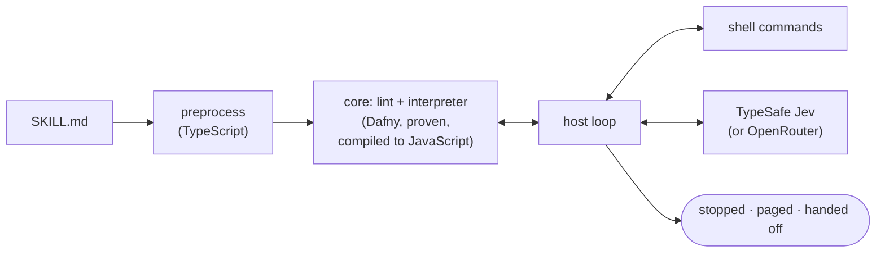

# skope

**Runbooks that an agent can read and a proven runtime can run.**

A skope skill is an ordinary Markdown file. A person or a language model can
read it and follow it. skope can also *execute* it: it runs the commands,
checks the results, and at the branch points asks
**[Jev](https://docs.typesafe.ai)**, TypeSafe's fast decision model, small
multiple-choice questions. When Jev isn't sure enough, skope stops and hands
the incident to a human or an agent, with a record of everything it already
did.

This is what you write:

```markdown
## Triage
Look at usage, recent errors and what's biggest on disk.

- **run** `df --output=pcent {mount} | tail -1` as used
- **check** {used} < {threshold}% → stop
- **run** `journalctl -p err -n 100 --no-pager` as errors
- **run** `du -xh -d2 /var /tmp /home | sort -h` as biggest · else skip
- **ask** Given {used}, {errors} and {biggest}, what's the best next step? · sure 85%
  - [Clean up]
  - [Restart]
  - [Page]
  - [Investigate]
```

And this is what a reader sees:

> #### Triage
> Look at usage, recent errors and what's biggest on disk.
>
> - **run** `df --output=pcent {mount} | tail -1` as used
> - **check** {used} < {threshold}% → stop
> - **run** `journalctl -p err -n 100 --no-pager` as errors
> - **run** `du -xh -d2 /var /tmp /home | sort -h` as biggest · else skip
> - **ask** Given {used}, {errors} and {biggest}, what's the best next step? · sure 85%
>   - [Clean up]
>   - [Restart]
>   - [Page]
>   - [Investigate]

The bold keywords are the program. Everything else is guidance for whoever
reads it, human or model. The whole skill is
[`fixtures/disk-full/SKILL.md`](fixtures/disk-full/SKILL.md).

---

## Why

Runbooks are either prose, which only a person or an expensive agent can
follow, or scripts, which can't use judgement. skope keeps one file for both,
and decides who does each step:

- **Code does what's certain:** measurements, comparisons and commands.
- **Jev makes the small judgement calls.** It only ever chooses between
  options the author wrote, and skope only acts when Jev is confident
  enough.
- **A person or an agent takes over the rest,** with a record of what
  already happened.

The common case costs about a tenth of a second of Jev time per question,
instead of an agent session, and every decision is logged.

## Install

```console
$ curl -fsSL https://github.com/mattyv/skope/releases/latest/download/install.sh | sh
$ skope --version
skope 0.1.0 (build identity 3f1c…)
```

That installs a single self-contained binary for Linux (x64, arm64) or
macOS (Apple silicon) into `~/.local/bin`. It doesn't need Node. The
installer checks the download against the release's checksums before
installing anything. Set `SKOPE_VERSION` to pin a version, or
`SKOPE_INSTALL_DIR` to install elsewhere.

Or, with Node 20 or newer, `npm install -g skope`. Or run the container
image, `ghcr.io/mattyv/skope`.

**Beta.** Until 0.1.0 is out, `latest` has nothing to install. Install the
beta by name:

```console
$ curl -fsSL https://github.com/mattyv/skope/releases/download/v0.1.0-beta.1/install.sh | SKOPE_VERSION=0.1.0-beta.1 sh
```

or `npm install -g skope@beta`, or `ghcr.io/mattyv/skope:0.1.0-beta.1`.

## Use

### Check

Check a skill before it ever runs. Lint catches dead ends, cycles, dangling
links, and command output that could leak into a command:

```console
$ skope disk-full/SKILL.md --lint
$ skope disk-full/SKILL.md --explain    # sections, transfer graph, worst-case cost
$ skope disk-full/SKILL.md --verify     # every path the run can take, and how each ends
```

### Rehearse

Rehearse it with fake command results and fake answers. Nothing real runs:

```console
$ skope disk-full/SKILL.md --dry-run --fake answers.yaml --fake-exec commands.yaml
```

Both files are JSON (so also YAML). Key each entry by what the statement
binds, `Section.var`, or by `Section.ask` for a section's only question.
Those keys survive edits to the skill. A statement that binds nothing
takes its line number, `line:N`, or its exact text after interpolation.
Every command the run reaches needs an answer, or it stops with
`E-FAKE-UNMATCHED`:

```json
{
  "Triage.used": { "exit": 0, "stdout": " 96%\n" },
  "Triage.errors": { "exit": 0, "stdout": "no obvious cause\n" }
}
```

```json
{ "Triage.ask": { "s:clean_up": 0.05, "s:restart": 0.05, "s:page": 0.85, "s:investigate": 0.05 } }
```

A key that names no statement gets warning `W-FAKE-UNUSED`, and one that
names two (a section that binds `used` twice) is `E-FAKE-AMBIGUOUS`.

Leave out `--fake` to rehearse against the real backend with fake command
results: that's how you check a skill's questions and thresholds.
[`fixtures/`](fixtures/) has worked pairs for the example skills.

### Test

To keep a rehearsal, save it as a test. Put each scenario in its own
directory under `tests/` next to the skill, with its fakes and an
`expect.yaml` that says what should happen. skope skips hidden directories
such as `tests/.cache`.

```
disk-full/
  SKILL.md
  tests/
    restart/
      commands.yaml
      answers.yaml
      expect.yaml
```

```yaml
outcome: paged
path: [Triage, Restart, Page]
asks:
  Triage: { chosen: Restart }
  Restart.service: { chosen: myapp-worker }
page_contains: "at 91%"
```

```console
$ skope disk-full/SKILL.md --test
PASS    restart
1 passed, 0 failed, 0 invalid
```

`expect.yaml` can check:

| Field | Passes when |
|---|---|
| `outcome`, `exit` | the run ends this way (`exit` follows from `outcome` if left out) |
| `path` or `path_prefix` | the run enters these sections, in order (all of them, or the first few) |
| `asks` | each named ask chose this option and cleared `sure` |
| `page_contains` | some page includes this text, as the skill wrote it |
| `handoff_reason` | a handoff happened for this reason, such as `gate_failed` |
| `max_ask_calls` | the run asked no more than this many questions |

A scenario must set `outcome`, `exit`, `path` or `path_prefix`. The full
rules are in [`docs/SPEC.md`](docs/SPEC.md) §7.3 and
[`contracts/expect.schema.json`](contracts/expect.schema.json).

Nothing real runs, not even the pager, and `do` steps go through the fakes,
so you can test what happens when one fails. Scripted tests don't read your
config either, so they need no API key and give the same result on every
machine; pass `--config` to test against one. It exits 0 when every
scenario passes, 60 when one fails, and 40 when a scenario itself is
broken, so it fits in CI. `--scenario tests/restart` runs just one.

A failing scenario prints the first difference and where its events are:

```console
FAIL    restart: asks.Triage: expected Restart, got Clean up (events: /tmp/skope-test-x1Y2/restart/events.jsonl)
```

Scripted tests check the skill's logic, not its questions. `--live` checks
the questions: every ask goes to the real backend, and each scenario runs
10 times (or `--runs N`, or `live.runs` in its `expect.yaml`):

```console
$ skope disk-full/SKILL.md --test --live --runs 5
skope: live: at most 30 backend calls to jev (jev-1.13.0)
PASS    restart
        hits 5/5 (min 1)
        Triage  Restart 5/5  conf min 97% med 98%  sure 85  margin +12
        Restart.service  myapp-worker 5/5  conf min 91% med 93%  sure 90  margin +1  WARN near gate
```

A run is a hit when it does everything `expect.yaml` says. A thin margin
over `sure` warns; set `live.min_margin` to make it fail, and
`live.min_hit_rate` to allow some misses. Live tests read your config for
the backend, and they cost what the calls cost: skope prints the most it
will make before it starts.

### Run

Then run it for real. A dry run runs the read-only `run` and `check`
commands, but never a `do` and never a page. It does ask the backend, so a
skill with an `ask` needs one configured (see below) even to dry-run. Every
run must say which it is:

```console
$ skope disk-full/SKILL.md --dry-run                  # look, don't touch
$ skope disk-full/SKILL.md --apply --param mount=/var # do it
```

Every step is one line of JSON on stdout:

```json
{"ts":"2026-09-23T03:12:44Z","run_id":"r-8f2c","skill":"disk-full","skill_hash":"sha256:…","host":"hk-app-03","event":"would_do","section":"Clean up","line":38,"cmd":"journalctl --vacuum-size=500M"}
```

## The language

A skill is Markdown with YAML frontmatter and `format: 1`. Each `##` heading
is a section, and a run moves from section to section until it ends.

| Keyword | Does |
|---|---|
| **run** `cmd` as x | Runs a read-only command, optionally keeping its output as `x` |
| **do** `cmd` | Runs a command that changes something. Skipped in a dry run. |
| **check** {x} < 80 → [Section] | Compares measured values, or checks that a command succeeds |
| **ask** question · sure 85% | Asks Jev to pick a section, yes or no, one item from a list, or a level from 1 to N |
| **for each** item in [List] | Repeats the nested steps for each item in a list |
| **if yes** do … | Acts on the answer to the yes-or-no question just asked |
| **then** [Section] | Moves to another section |
| **page** "…" | Pages a human and ends the run |
| **hand off** | Hands the incident to a person or agent, with the section's prose as instructions |
| **stop** | Ends the run |

A bold word that looks like a keyword but isn't one is an error, never
prose, so a typo can't silently skip a step. The full grammar is in
[`docs/SPEC.md`](docs/SPEC.md).

## How a run ends

| Outcome | Why | Exit code |
|---|---|---|
| stopped | the skill finished | 0 |
| paged | the skill paged a human | 10 |
| handed off | Jev wasn't sure enough, a command failed, or the skill said to | 20 |
| locked | another run of this skill is in progress | 30 |
| stale lock | an earlier run died holding the lock | 31 |
| invalid | the skill failed its checks, so nothing ran | 40 |
| error | something went wrong inside skope | 50 |

A handoff writes a record of what ran, what each command returned and why
skope stopped. With `--apply`, skope also pages someone about it, so an
unattended alert never ends in a record nobody reads. An agent calling skope
sets `SKOPE_CALLER=agent` and takes the record itself.

## Built on TypeSafe's Jev

skope's questions are answered by **[Jev](https://docs.typesafe.ai)**,
TypeSafe's System One model. Jev isn't a chatbot: it's trained to make fast,
narrow decisions and to return a calibrated probability for every possible
answer, which is exactly what skope's confidence thresholds need. It answers
in about a tenth of a second.

Each of skope's question forms maps onto one of Jev's three question types:

| In a skill | Jev question type | What skope does with the answer |
|---|---|---|
| `ask` with a list of `[Section]` options | Choice | moves to the chosen section |
| `→ one of [List] as x` | Choice | keeps the chosen item as `x` |
| `→ yes \| no` | Noul | keeps yes or no, for `if yes` |
| `→ 1 to 4 as x` | Score | keeps the level as `x`, for `check` |

skope sends Jev only the evidence a question names. It pins a Jev version,
because a threshold like `sure 85%` is tuned against a particular model, and
it checks every answer against the options the author wrote before acting on
it. Get an API key from [TypeSafe](https://docs.typesafe.ai) and set
`TYPESAFE_API_KEY`.

```yaml
# ~/.config/skope/config.yaml
ask:
  backend: jev
jev:
  model: jev-1.13.0     # pin a version: thresholds are tuned against it
  key_env: TYPESAFE_API_KEY
pager:
  command: /usr/local/bin/page-oncall   # reads the message on stdin
```

Jev is also served by OpenRouter, billed to your OpenRouter account. It
isn't a chat model, so it doesn't appear in OpenRouter's `/api/v1/models`
list, and the `openrouter` backend below can't use it. Point the `jev`
backend at OpenRouter's System One endpoint instead:

```yaml
jev:
  model: typesafe/jev-1.13-20260917   # dated snapshot = pinned
  key_env: OPENROUTER_API_KEY
  url: https://openrouter.ai/api/v1/systemone
```

skope reads the key from its own environment, so a shell that hasn't
re-read your profile since you changed the key sends the old one. A `401`
from the backend usually means that.

**OpenRouter is the alternative.** Any model on
[OpenRouter](https://openrouter.ai) that exposes token probabilities can
answer instead. skope reads the model's probability for each option's
letter, never a confidence the model writes about itself. A general model
isn't trained for these decisions the way Jev is, so re-tune your
thresholds before trusting a skill on it.

Secrets are redacted before anything leaves the machine or reaches a log.

## What skope guarantees

| Guarantee | How |
|---|---|
| The model only ever picks one of the author's options. It never writes a command. | The grammar can't express anything else, and it's proven. |
| Command output never becomes part of a command. | The taint rule, checked by lint and proven. |
| A dry run never executes a `do`. | Proven over every possible run. |
| Every run ends, with exactly one outcome. | Proven. |
| Every skill is checked before it runs. | Lint, proven sound: a skill that passes can't hit an internal error. |
| Confidence is measured, never self-reported. | Jev's calibrated distribution, or token probabilities. |

## How it works



The core is a pure step function written in [Dafny](https://dafny.org):
given the state and the last result, it returns the next state and the next
request. The guarantees above are proven about that function. It's then
compiled to JavaScript and driven by a small TypeScript host, so the same
interpreter runs real incidents, rehearsals with fakes, and the path
explorer behind `--verify`.

## Develop

```console
$ npm ci
$ npm test            # builds, then runs every test
$ npm run lint        # Biome: lint and formatting
$ npx tsc --noEmit    # type check
```

Changing the Dafny core needs Dafny 4.11.0, the version pinned in
`.dafny-version`. The compiled JavaScript is committed, so nothing else
does:

```console
$ DAFNY=/path/to/dafny npm run core   # verify the proofs and rebuild core/generated
```

## Read more

- [`docs/SPEC.md`](docs/SPEC.md) is the language: syntax, semantics, proofs, backends
  and the CLI.
- [`docs/PLAN.md`](docs/PLAN.md) is how it's built: phases, parallel agents,
  test-first streams, reviews and releases.
- [`docs/design/`](docs/design/) holds designs for work in progress, such
  as [skill tests](docs/design/skill-tests.md).
- [`contracts/`](contracts/) holds the shapes the parts of skope agree on,
  with worked examples.

## License

Licensed under either of the [Apache License, Version 2.0](LICENSE-APACHE)
or the [MIT license](LICENSE-MIT), at your option.
