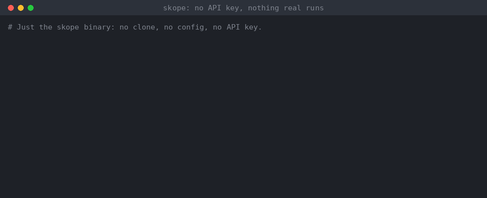

# skope

**Let agents act on production without handing them a shell.**

An agent writes the automation as a skope skill. You approve its scope:
every command it could ever run, in one list. skope then runs it in
milliseconds, asks a small model only the judgement calls, and hands back to
the agent or a person when it isn't sure. Change a command and it won't run
until you approve again. Skills are unit tested, and the part that decides
what runs is mathematically proven.

A skope skill is an ordinary Markdown file that a person can read and
review. skope executes it: it runs the commands, checks the results, and at
the branch points asks
**[Jev](https://docs.typesafe.ai)**, TypeSafe's fast decision model, small
multiple-choice questions. When Jev isn't sure enough, skope stops and hands
the incident to a human or an agent, with a record of everything it already
did.



This is what you write:

```markdown
## Triage
Look at usage, recent errors and what's biggest on disk.

- **run** `df --output=pcent {mount} | tail -1` as used
- **check** {used} < {threshold}% → stop
- **run** `journalctl -p err -n 100 --no-pager` as errors
- **run** `du -xh -d2 /var /tmp /home | sort -h` as biggest · else skip
- **ask** Given {used}, {errors} and {biggest}, what's the best next step? · sure 85%
  - [Clean up]
  - [Restart]
  - [Page]
  - [Investigate]
```

And this is what a reader sees:

> #### Triage
> Look at usage, recent errors and what's biggest on disk.
>
> - **run** `df --output=pcent {mount} | tail -1` as used
> - **check** {used} < {threshold}% → stop
> - **run** `journalctl -p err -n 100 --no-pager` as errors
> - **run** `du -xh -d2 /var /tmp /home | sort -h` as biggest · else skip
> - **ask** Given {used}, {errors} and {biggest}, what's the best next step? · sure 85%
>   - [Clean up]
>   - [Restart]
>   - [Page]
>   - [Investigate]

The bold keywords are the program. Everything else is guidance for whoever
reads it, human or model. The whole skill is
[`fixtures/disk-full/SKILL.md`](fixtures/disk-full/SKILL.md). You can
[try it in a minute](#try-it) with no API key.

---

## Why

Agents are good at working out what to do, but slow and costly to run every
time, and risky to leave alone with production access. Scripts are fast and
predictable, but can't use judgement, and an agent-written script can do
anything. To know what it might do, you have to read all of it.

A skope skill sits between the two. **Everything it could ever do is
visible before it runs:** a command can't be assembled from anything it
reads at run time, so `skope --effects` lists every possible command, and
with approvals on, skope refuses to run until a person has approved exactly
that list (see [Approve](#approve)). Inside that scope, skope decides who
does each step:

- **Code does what's certain:** measurements, comparisons and commands.
- **Jev makes the small judgement calls.** It only ever chooses between
  options the author wrote, and skope only acts when Jev is confident
  enough.
- **A person or an agent takes over the rest,** with a record of what
  already happened.

**It's fast and cheap.** An agent following a runbook reads the whole file
and every command's output, and reasons over several turns: minutes and a
real model bill per incident. skope runs the commands and checks itself,
which cost nothing, and only asks Jev the judgement calls. Each is one small
question with just the evidence it names, answered in about a tenth of a
second. So the common case takes seconds and costs a fraction of a cent, the
agent's time is kept for the incidents that need it, and every decision is
logged. For an outside measure of the same pattern, the
[jev-oncall](https://github.com/mingleiw/jev-oncall) alert triager reports
418 ms at p50 and $0.04 per 1,000 alerts.

**You can test it like code.** A skill an agent reads as a prompt can only
be checked by trying it and reading what happened. A skope skill has unit
tests: scenarios next to it fake the commands and answers, and
`skope --test` checks the path, the outcome and every decision, with nothing
real run, fast enough for CI. `skope --test --live` then asks the real model
the same questions, several times each, and reports how often it chose right
and how close it came to its confidence bar. That catches a question that's
missing the evidence it needs before an incident does (see
[Test](#test)).

**Why trust it with production?** The core that decides what runs next is
written in [Dafny](https://dafny.org), a language whose compiler checks
mathematical proofs alongside the code. Tests show a bug isn't there for the
inputs you tried; a proof shows it can't happen for any skill or any run. So
"a dry run never runs a `do`" and "command output never ends up in a command"
aren't hopes backed by a test suite. They're checked on every commit, with no
shortcuts (no `assume`, no skipped proofs). The rest of skope, which talks to
the shell, the pager and the backend, is ordinary tested TypeScript.

## Install

skope is in beta. Install the beta by name:

```console
$ curl -fsSL https://github.com/mattyv/skope/releases/download/v0.1.0-beta.2/install.sh | SKOPE_VERSION=0.1.0-beta.2 sh
$ skope --version
skope 0.1.0-beta.2 (build identity …)
```

That installs a single self-contained binary for Linux (x64, arm64) or
macOS (Apple silicon) into `~/.local/bin`. It doesn't need Node. The
installer checks the download against the release's checksums before
installing anything. Set `SKOPE_INSTALL_DIR` to install elsewhere.

Or run the container image, `ghcr.io/mattyv/skope:0.1.0-beta.2`.

**Not on npm yet.** The `skope` name on npm belongs to an unrelated
project, so don't `npm install skope`. A package under a different name
will follow.

If you use Claude Code (`~/.claude` exists), the installer also installs
two agent skills:
[`write-skope-skill`](skills/write-skope-skill/SKILL.md) has an agent write
skope skills test first, and
[`run-skope-skill`](skills/run-skope-skill/SKILL.md) has one run a skope
skill through skope, never by hand, and take over when skope hands off. Set `SKOPE_NO_SKILL=1` to skip them.

### Try it

No API key, no config, and nothing real runs:

```console
$ skope --demo              # writes the disk-full skill, its tests and fakes
$ cd skope-demo
$ skope SKILL.md --test     # its unit tests
PASS    false-alarm
PASS    model-unsure
PASS    nothing-fits
PASS    restart-fixes-it
PASS    restart-hangs
PASS    restart-not-enough
6 passed, 0 failed, 0 invalid
$ skope SKILL.md --verify   # every path it can take, and how each ends
$ skope SKILL.md --dry-run --fake answers.yaml --fake-exec commands.yaml
```

skope's output is JSON on stdout, one event per line, for scripts and
agents; a person reads stderr: errors, `--verify`'s summary, and one line
when a run hands off. `--test` prints its JSON only when stdout isn't a
terminal, so at a terminal you see just the PASS lines. In the dry run, the faked model
picks Restart and then `myapp-worker`, skope logs the restart it *would*
do, and disk usage drops under target. Now make the model less sure: in `answers.yaml`,
move 0.2 from `s:restart` to `s:page` (each ask's probabilities add up to
1), or replace the whole answer with `Triage.ask: unsure`. Run it again,
and skope hands off instead of guessing: it exits 20 and says where on stderr.

## Use

### Check

Check a skill before it ever runs. Lint catches dead ends, cycles, dangling
links, and command output that could leak into a command:

```console
$ skope disk-full/SKILL.md --lint
$ skope disk-full/SKILL.md --verify     # every path the run can take, and how each ends
```

### Approve

Before a skill runs anywhere real, see everything it could do:

```console
$ skope disk-full/SKILL.md --effects
skope: disk-full can run 12 commands, 9 of them changing things (sha256:b03238161bae…)
  do   apt-get clean    [Clean up]
  do   systemctl restart myapp-worker    [Restart]
  …
  run  df --output=pcent {mount} | tail -1    [Triage, Clean up, Restart]
```

Every command is written out, with list items such as the services filled
in. That works because command output can never reach a command (proven),
so nothing is assembled at run time. A param stays `{mount}`, since the
caller sets it, and `--effects` names it as open. To pin it, give it
choices in the skope block, and it's listed as each one:

```yaml
params:
  mount: { default: /, choices: [/, /var] }   # --param mount=/tmp is refused
```

Turn approvals on in the config with `approvals: /etc/skope/approvals`,
somewhere the user or agent running skope can't write. Or use
`approvals: beside-skill` to keep each approval next to its skill, as
`disk-full.approval.json`, reviewed in pull requests (protect it with
CODEOWNERS, so an agent can't approve its own change). Then no dry run or
apply happens until a person runs `--approve`, and any change to the command
list stops it again:

```console
$ skope disk-full/SKILL.md --approve
skope: approved disk-full: /etc/skope/approvals/disk-full.approval.json
$ # the agent adds a command to the skill…
$ skope disk-full/SKILL.md --apply
E-NOT-APPROVED: disk-full's commands changed since it was approved (+ do   rm -rf /var/cache). Review them with --effects, then approve with --approve
```

Rewording guidance or questions, or changing `sure`, keeps the approval, and
`--verify` shows the paths. Approval doesn't make an approved command safe:
`do ./fix.sh` runs whatever the script does. What it guarantees is that
nothing outside the approved list runs.

### Rehearse

Rehearse it with fake command results and fake answers. Nothing real runs:

```console
$ skope disk-full/SKILL.md --dry-run --fake answers.yaml --fake-exec commands.yaml
```

Both files are JSON (so also YAML). Key each entry by what the statement
binds, `Section.var`, or by `Section.ask` for a section's only question.
Those keys survive edits to the skill. A statement that binds nothing
takes its line number, `line:N`, or its exact text after interpolation.
Every command the run reaches needs an answer, or it stops with
`E-FAKE-UNMATCHED`:

```json
{
  "Triage.used": { "exit": 0, "stdout": " 96%\n" },
  "Triage.errors": { "exit": 0, "stdout": "no obvious cause\n" }
}
```

```json
{ "Triage.ask": { "s:clean_up": 0.05, "s:restart": 0.05, "s:page": 0.85, "s:investigate": 0.05 } }
```

A key that names no statement gets warning `W-FAKE-UNUSED`, and one that
names two (a section that binds `used` twice) is `E-FAKE-AMBIGUOUS`.

Leave out `--fake` to rehearse against the real backend with fake command
results: that's how you check a skill's questions and thresholds.
[`fixtures/`](fixtures/) has worked pairs for the example skills.

### Test

To keep a rehearsal, save it as a test. The easiest way is one `tests.yaml`
beside the skill: shared defaults, then each scenario's own commands,
answers and what should happen, all in one file.

```
disk-full/
  SKILL.md
  tests.yaml
```

```yaml
defaults:
  commands:
    Triage.used: "93%\n"              # a string or number is shorthand for {exit: 0, stdout: "..."}
    Triage.errors: "myapp-worker OOM\n"
    Triage.biggest: "40G\t/var\n"
    systemctl restart myapp-worker: { exit: 0 }
scenarios:
  restart:
    commands:
      Restart.used: "91%\n"           # overrides the default for this scenario only
    outcome: paged
    path: [Triage, Restart, Page]
    asks:
      Triage: { chosen: Restart }
      Restart.service: { chosen: myapp-worker }
    page_contains: "at 91%"
  investigate:
    outcome: handoff
    asks:
      Triage: { chosen: Investigate }
```

Neither scenario has an `answers.yaml`: naming an ask's expected choice in
`asks` is enough, in scripted mode, for skope to script that answer itself,
confidently. Give an explicit answer only for an ask you want to script
differently.

```console
$ skope disk-full/SKILL.md --test
PASS    investigate
PASS    restart
2 passed, 0 failed, 0 invalid
```

A scenario's own `commands` and `answers` merge over `defaults`' key by
key, and every other field (`outcome`, `path`, `asks`, ...) is
`expect.yaml`'s own field, at the scenario's top level:

| Field | Passes when |
|---|---|
| `outcome`, `exit` | the run ends this way (`exit` follows from `outcome` if left out) |
| `path` or `path_prefix` | the run enters these sections, in order (all of them, or the first few) |
| `asks` | each named ask chose this option and cleared `sure` |
| `page_contains` | some page includes this text, as the skill wrote it |
| `handoff_reason` | a handoff happened for this reason, such as `gate_failed` |
| `max_ask_calls` | the run asked no more than this many questions |

A scenario must set `outcome`, `exit`, `path` or `path_prefix`. The full
rules are in [`docs/SPEC.md`](docs/SPEC.md) §7.3 and
[`contracts/expect.schema.json`](contracts/expect.schema.json).

Nothing real runs, not even the pager, and `do` steps go through the fakes,
so you can test what happens when one fails. Scripted tests don't read your
config either, so they need no API key and give the same result on every
machine; pass `--config` to test against one. It exits 0 when every
scenario passes, 60 when one fails, and 40 when a scenario itself is
broken, so it fits in CI. `--scenario restart` runs just that one.

A scenario can still live in its own directory under `tests/`, with
`commands.yaml`, `answers.yaml` and `expect.yaml` as separate files
(`--scenario tests/restart` runs one this way); skope skips hidden
directories such as `tests/.cache`. `tests.yaml` and `tests/` scenarios run
together, sorted by name, and the string shorthand and derived `asks`
answers work the same in both.

A failing scenario prints the first difference and where its events are:

```console
FAIL    restart: asks.Triage: expected Restart, got Clean up (events: /tmp/skope-test-x1Y2/restart/events.jsonl)
```

Scripted tests check the skill's logic, not its questions. `--live` checks
the questions: every ask goes to the real backend, and each scenario runs
10 times (or `--runs N`, or `live.runs` in its `expect.yaml`):

```console
$ skope disk-full/SKILL.md --test --live --runs 5
skope: live: at most 30 backend calls to jev (jev-1.13.0)
PASS    restart
        hits 5/5 (min 1)
        Triage  Restart 5/5  conf min 97% med 98%  sure 85  margin +12
        Restart.service  myapp-worker 5/5  conf min 91% med 93%  sure 90  margin +1  WARN near gate
```

A run is a hit when it does everything `expect.yaml` says. A thin margin
over `sure` warns; set `live.min_margin` to make it fail, and
`live.min_hit_rate` to allow some misses. Live tests read your config for
the backend, and they cost what the calls cost: skope prints the most it
will make before it starts.

**Having an agent write the skill?** skope comes with
[`write-skope-skill`](skills/write-skope-skill/SKILL.md), an agent skill
that makes the agent write `tests.yaml` first, watch it fail, then write
the skill until `--lint`, `--verify` and `--test` are clean, and finally
check the questions with `--live`. Installing skope puts it in Claude
Code's skills directory if you have one, along with `run-skope-skill`;
`skope --install-skill [DIR]` installs them anywhere else, such as
`.claude/skills` in your repo.

### Run

Then run it for real. A dry run runs the read-only `run` and `check`
commands, but never a `do` and never a page. It does ask the backend, so a
skill with an `ask` needs one configured (see below) even to dry-run. Every
run must say which it is:

```console
$ skope disk-full/SKILL.md --dry-run                  # look, don't touch
$ skope disk-full/SKILL.md --apply --param mount=/var # do it
```

Every step is one line of JSON on stdout:

```json
{"ts":"2026-09-23T03:12:44Z","run_id":"r-8f2c","skill":"disk-full","skill_hash":"sha256:…","host":"hk-app-03","event":"would_do","section":"Clean up","line":44,"cmd":"journalctl --vacuum-size=500M"}
```

## The language

A skill is an ordinary agent skill, with `name` and `description` in its
frontmatter, plus a `skope` code block after the title that holds
`format: 1`, the params and the limits. The block is in the body, not the
frontmatter, so an agent following the skill can see the params' defaults,
and the frontmatter stays valid for uploading to claude.ai. A line under the
title tells agents it's a skope skill. Each `##` heading is a section, and a
run moves from section to section until it ends.

| Keyword | Does |
|---|---|
| **run** `cmd` as x | Runs a read-only command, optionally keeping its output as `x` |
| **do** `cmd` | Runs a command that changes something. Skipped in a dry run. |
| **check** {x} < 80 → [Section] | Compares measured values, or checks that a command succeeds |
| **ask** question · sure 85% | Asks Jev to pick a section, yes or no, one item from a list, or a level from 1 to N |
| **for each** item in [List] | Repeats the nested steps for each item in a list |
| **if yes** do … | Acts on the answer to the yes-or-no question just asked |
| **then** [Section] | Moves to another section |
| **page** "…" | Pages a human and ends the run |
| **hand off** | Hands the incident to a person or agent, with the section's prose as instructions |
| **stop** | Ends the run |

Variables come from `run … as x` (the command's trimmed output), from an
`ask`'s answer, and from params. They can go into `check`, `ask` questions
and `page` text. **Command output never goes into a command** (lint rejects
it as `E-TAINT`), so a command can use params and items from the skill's own
lists, including one an `ask` picked, but never what another command
printed. There's no arithmetic either: `check` only compares. Do the maths
inside a command (`free -m | awk '/Mem/ {print int($3*100/$2)}'`). To
combine two measurements, take them in one command, or compare them with
`check {after} < {before}`.

A bold word that looks like a keyword but isn't one is an error, never
prose, so a typo can't silently skip a step. The full grammar is in
[`docs/SPEC.md`](docs/SPEC.md).

## How a run ends

| Outcome | Why | Exit code |
|---|---|---|
| stopped | the skill finished | 0 |
| paged | the skill paged a human | 10 |
| handed off | Jev wasn't sure enough, a command failed, or the skill said to | 20 |
| locked | another run of this skill is in progress | 30 |
| stale lock | an earlier run died holding the lock | 31 |
| invalid | the skill failed its checks, so nothing ran | 40 |
| error | something went wrong inside skope | 50 |

A handoff writes a record of what ran, what each command returned and why
skope stopped. With `--apply`, skope also pages someone about it, so an
unattended alert never ends in a record nobody reads. An agent calling skope
sets `SKOPE_CALLER=agent` and takes the record itself.

## Built on TypeSafe's Jev

skope's questions are answered by **[Jev](https://docs.typesafe.ai)**,
TypeSafe's System One model. Jev isn't a chatbot: it's trained to make fast,
narrow decisions and to return a probability for every possible answer,
which is exactly what skope's confidence thresholds need. It answers
in about a tenth of a second.

Each of skope's question forms maps onto one of Jev's three question types:

| In a skill | Jev question type | What skope does with the answer |
|---|---|---|
| `ask` with a list of `[Section]` options | Choice | moves to the chosen section |
| `→ one of [List] as x` | Choice | keeps the chosen item as `x` |
| `→ yes \| no` | Noul | keeps yes or no, for `if yes` |
| `→ 1 to 4 as x` | Score | keeps the level as `x`, for `check` |

skope sends Jev only the evidence a question names. It pins a Jev version,
because a threshold like `sure 85%` is tuned against a particular model, and
it checks every answer against the options the author wrote before acting on
it. Get an API key from [TypeSafe](https://docs.typesafe.ai) and set
`TYPESAFE_API_KEY`.

```yaml
# ~/.config/skope/config.yaml
ask:
  backend: jev
jev:
  model: jev-1.13.0     # pin a version: thresholds are tuned against it
  key_env: TYPESAFE_API_KEY
pager:
  command: /usr/local/bin/page-oncall   # reads the message on stdin
```

Jev is also served by OpenRouter, billed to your OpenRouter account. It
isn't a chat model, so it doesn't appear in OpenRouter's `/api/v1/models`
list, and the `openrouter` backend below can't use it. Point the `jev`
backend at OpenRouter's System One endpoint instead:

```yaml
jev:
  model: typesafe/jev-1.13-20260917   # dated snapshot = pinned
  key_env: OPENROUTER_API_KEY
  url: https://openrouter.ai/api/v1/systemone
```

skope reads the key from its own environment, so a shell that hasn't
re-read your profile since you changed the key sends the old one. A `401`
from the backend usually means that.

**OpenRouter is the alternative.** Any model on
[OpenRouter](https://openrouter.ai) that exposes token probabilities can
answer instead. skope reads the model's probability for each option's
letter, never a confidence the model writes about itself. A general model
isn't trained for these decisions the way Jev is, so re-tune your
thresholds before trusting a skill on it.

Secrets are redacted before anything leaves the machine or reaches a log.

### Choosing `sure`

A confidence gate is only as good as the question behind it. An
[independent calibration study](https://github.com/scienthoon/jev-ood-calibration)
of 4,621 Jev calls found:

- **When the answer isn't in the evidence, Jev is confidently wrong, not
  unsure.** On labels it couldn't work out from the text, it averaged 0.74
  confidence while being right 45% of the time. No `sure` catches that.
  Put the deciding fact in the question's evidence, and use
  `--test --live` to check.
- **Calibration depends on the question type.** Yes/no answers were
  under-confident, Choice answers slightly over-confident, and Score
  answers badly over-confident. A yes/no gate errs towards handing off;
  don't gate on a Score level alone (skope warns, `W-SCORE-THRESHOLD`).
- **Use the probability, not the model's own confidence field.** skope
  already gates on the chosen option's probability.

So set `sure` from the margins `--test --live` reports on your own
questions, and re-check them when you change the model version.

## What skope guarantees

"Proven" below means a Dafny proof over every possible skill and every
possible run, re-checked by CI on every commit. A change that broke one of
these wouldn't get through CI, even if every test still passed.

| Guarantee | How |
|---|---|
| The model only ever picks one of the author's options. It never writes a command. | The grammar can't express anything else, and it's proven. |
| Command output never becomes part of a command. | The taint rule, checked by lint and proven. |
| A dry run never executes a `do`. | Proven over every possible run. |
| Every run ends, with exactly one outcome. | Proven. |
| Every skill is checked before it runs. | Lint, proven sound: a skill that passes can't hit an internal error. |
| With approvals on, only the approved commands can run. | The list is complete because of the taint rule, which is proven; the check against the approval before any run is tested TypeScript. |
| Confidence is measured, never self-reported. | The probability Jev gives each option, or a model's token probabilities; never a confidence the model writes about itself. |

## How it works


The core is a pure step function written in [Dafny](https://dafny.org):
given the state and the last result, it returns the next state and the next
request. The guarantees above are proven about that function. It's then
compiled to JavaScript and driven by a small TypeScript host, so the same
interpreter runs real incidents, rehearsals with fakes, and the path
explorer behind `--verify`.

## Develop

```console
$ npm ci
$ npm test            # builds, then runs every test
$ npm run lint        # Biome: lint and formatting
$ npx tsc --noEmit    # type check
```

Changing the Dafny core needs Dafny 4.11.0, the version pinned in
`.dafny-version`. The compiled JavaScript is committed, so nothing else
does:

```console
$ DAFNY=/path/to/dafny npm run core   # verify the proofs and rebuild core/generated
```

## Read more

- [`docs/SPEC.md`](docs/SPEC.md) is the language: syntax, semantics, proofs, backends
  and the CLI.
- [`docs/PLAN.md`](docs/PLAN.md) is how it's built: phases, parallel agents,
  test-first streams, reviews and releases.
- [`docs/design/`](docs/design/) holds designs for work in progress, such
  as [skill tests](docs/design/skill-tests.md).
- [`skills/`](skills/) holds the agent skills skope installs:
  [`write-skope-skill`](skills/write-skope-skill/SKILL.md) (write skope
  skills test first) and [`run-skope-skill`](skills/run-skope-skill/SKILL.md)
  (run one, or take over a handoff).
- [`contracts/`](contracts/) holds the shapes the parts of skope agree on,
  with worked examples.

## License

Licensed under either of the [Apache License, Version 2.0](LICENSE-APACHE)
or the [MIT license](LICENSE-MIT), at your option.
